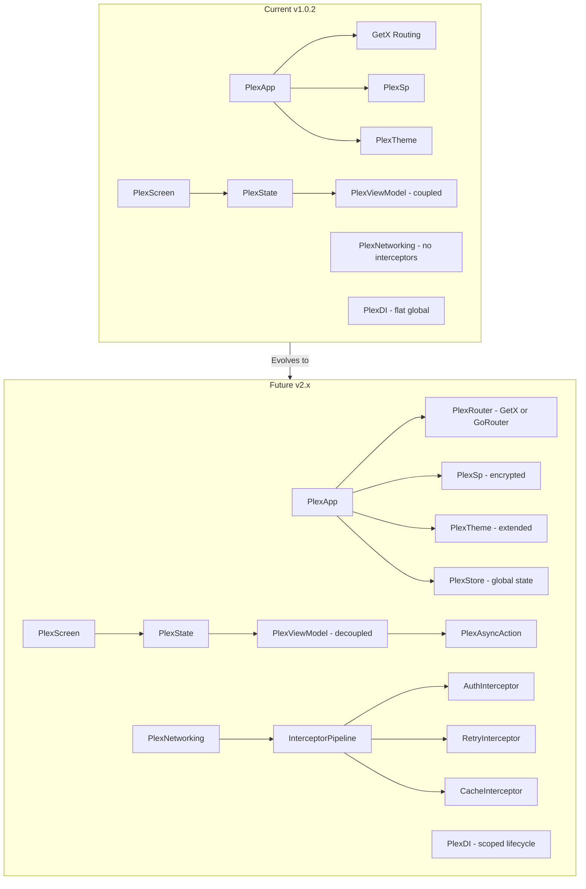

# Plex Library — Comprehensive Future Roadmap

## Executive Summary

The `plex` library (v1.0.2) is a well-structured Flutter application framework providing app scaffolding, MVVM, reactive state, networking, local DB, a rich widget set, and data tables. It already solves real enterprise problems. The roadmap below identifies gaps, fragile patterns, and entirely missing capabilities, then proposes concrete improvements organized into phases.

---

## Current State Audit

### Strengths

- Complete app bootstrapping in a single `PlexApp` widget
- Tiered data table system (basic / paginated / Syncfusion advanced)
- Rich form-field family with a consistent API
- Built-in SignalR, QR scanner, Excel/PDF export, shimmer loading
- Theming with Material 3, dark mode, image-based color schemes

### Pain Points / Gaps

- **No tests anywhere** — zero test coverage across all 60 source files
- `PlexRx` prints to console on every value change (debug noise, not production-safe)
- Code generation (`plex_annotations`) is fully commented out and non-functional
- `PlexInputWidget` is deprecated but still ships, creating confusion
- DI is a flat global list — no scoping, no lifecycle, no auto-disposal
- Networking has no interceptors, no retry, no caching, no cancellation
- Only one background type (`neoGlass`), limited theming extensibility
- Hard dependency on GetX for routing; no GoRouter / declarative routing path
- No i18n / localization support
- No accessibility (a11y) annotations or semantic labels
- `PlexViewModel` is tightly coupled to `PlexState` — hard to unit test

---

## Phase 1 — Foundation & Quality (v1.1.x)

### 1.2 Remove `PlexInputWidget` (Deprecated) ⚠️ SKIPPED FOR NOW

- Move it to a `plex_legacy/` sub-path (still importable but clearly separated)
- Add a migration guide comment block at the top of the file pointing to `PlexFormField`*
- Add a `@Deprecated` lint directive so IDEs show it struck-through

### 1.3 Revive Code Generation (`plex_annotations`)

> **Note:** No action on this item yet — planned for a future iteration.

**The generator currently does nothing at runtime.** Uncomment and complete:

- `@PlexAnnotationModel` → generates `copyWith()`, `toJson()`, `fromJson()`, `asString()`, equality `==` / `hashCode`
- Add `@PlexAnnotationField(ignore: true, rename: 'alias')` for field-level control
- Wire up `build_runner` properly in `pubspec.yaml` (dev dependencies: `build_runner`, `source_gen`, `analyzer`)
- Provide a `README` snippet for `flutter pub run build_runner build`

### 1.4 Introduce Test Infrastructure

- Add `flutter_test`, `mocktail`, `fake_async` to `dev_dependencies`
- Write unit tests for: `PlexSp`, `PlexDI`, `PlexNetworking` (mocked HTTP client), `PlexDb`, `PlexRx`, `PlexWidgetController`
- Write widget tests for: `PlexFormFieldInput`, `PlexFormFieldDropdown`, `PlexLoginScreen` (mocked `onLogin`)
- Target: ≥70% line coverage

### 1.5 Logging & Debug Utilities

Replace ad-hoc `console()` + `print()` scattered across the codebase:

- Introduce `PlexLogger` with levels: `verbose`, `debug`, `info`, `warning`, `error`
- `PlexLogger.setLevel(PlexLogLevel)` — suppress below a level in release builds
- Structured output: `[PLEX][NetworkingLayer] GET /users — 200 OK (142ms)`
- Optional remote log sink: `PlexLogger.addSink(PlexLogSink sink)` for Sentry / Crashlytics

---

## Phase 2 — Networking Overhaul (v1.2.x)

### 2.1 Interceptor Pipeline

**Problem:** `PlexNetworking` builds and fires requests directly — no hooks for auth refresh, logging, or transformation.

```
Request → [AuthInterceptor] → [LogInterceptor] → HTTP → [LogInterceptor] → [RetryInterceptor] → Response
```

- `abstract class PlexInterceptor { onRequest(...); onResponse(...); onError(...); }`
- `PlexNetworking.instance.addInterceptor(interceptor)`
- Ship built-in: `PlexAuthInterceptor` (adds `Authorization` header from a token provider), `PlexRetryInterceptor(maxAttempts, retryOn)`

### 2.2 Request Cancellation & Timeouts

- Expose `CancelToken` (wrapping `http`'s abort mechanism or switching to `dio`)
- `PlexNetworking.instance.defaultTimeout = Duration(seconds: 30)`
- Per-request timeout override

### 2.3 Response Caching

- `PlexNetworking.instance.enableCache(PlexCacheConfig(...))` — cache GET responses in `PlexDb` (Sembast)
- `PlexCacheConfig`: `maxAge`, `maxStale`, `cacheKey` builder
- Manual invalidation: `PlexNetworking.instance.clearCache(pattern)`

### 2.4 Proper Error Hierarchy

Replace the flat `PlexError(code, message)` with:

```dart
sealed class PlexNetworkError {
  PlexNetworkTimeout
  PlexNetworkNoConnectivity
  PlexNetworkServerError(int statusCode, dynamic body)
  PlexNetworkParseError(String cause, dynamic raw)
  PlexNetworkCancelled
}
```

### 2.5 Type-Safe Response Parsing

- `PlexNetworking.get<T>(path, fromJson: T Function(Map))` → `Future<PlexApiResponse<T>>`
- Eliminates manual JSON casting at call sites

### 2.6 Remove `allowBadCertificateForHTTPS` from Production Path

- Move to a `PlexNetworkingDebug` extension only importable in non-release builds (compile-time guard)

---

## Phase 3 — State Management Evolution (v1.3.x)

### 3.1 `PlexStore` — Structured Global State

The current `PlexWidgetController` is good for local widget state. For app-level state:

- `abstract class PlexStore<S> { S get state; void emit(S newState); Stream<S> get stream; }`
- `PlexStoreWidget<S extends PlexStore>` — rebuilds subtree when state changes
- `context.readStore<S>()` / `context.watchStore<S>()` extension helpers
- Automatically registered in `PlexDI` by type

### 3.2 `PlexViewModel` Decoupling

**Problem:** `PlexViewModel<Sc, St>` holds a direct reference to the `PlexState` widget — impossible to test without a running widget tree.

- Extract `PlexViewModelBase` with no UI dependency; holds only state + loading flag
- `PlexState` attaches/detaches via `ViewModel.attach(this)` / `ViewModel.detach()`
- `PlexViewModel` can now be instantiated and tested in pure Dart unit tests

### 3.3 Async Action System

- `PlexAsyncAction<T>` wraps a `Future<T>` with automatic loading/error state
- `PlexState.runAction(action)` — shows loading, catches errors, updates UI
- Eliminates boilerplate: `showLoading(); try { ... } catch { ... } finally { hideLoading(); }`

---

## Phase 4 — DI & Lifecycle (v1.4.x)

### 4.1 Scoped DI

**Problem:** Current DI is a flat global map — no lifetime management, no cleanup.

- `PlexScope` — named lifecycle scope (e.g., `"session"`, `"cart"`)
- `injectScoped<T>(builder, scope: "session")` — disposed when `PlexScope.close("session")`
- `PlexScreen` auto-creates and closes a screen-level scope
- `PlexViewModel` registered within screen scope → auto-disposed on `dispose()`

### 4.2 Circular Dependency Detection

- On `fromPlex<T>()`, track resolution chain; throw `PlexCircularDependencyError` with the full cycle path

### 4.3 Lazy Initialization with Async Support

- `injectSingletonLazyAsync<T>(Future<T> Function() builder)` — awaited on first access
- Useful for: database connections, remote config, authenticated API clients

---

## Phase 5 — Navigation Modernization (v1.5.x)

### 5.1 Declarative Routing Support

- Abstract `PlexRouter` interface with two implementations:
  - `PlexGetXRouter` (current behavior, wraps GetX)
  - `PlexGoRouter` (wraps `go_router`, supports deep links and web URL sync)
- `PlexApp(router: PlexGoRouter(...))` — swap without changing screen code

### 5.2 Deep Linking & Web URL Sync

- `PlexRoute.path` for parameterized routes: `"/orders/:id"`
- `Plex.toNamed("/orders/42", params: {"id": "42"})` — type-safe params via `PlexRouteArgs`
- Web: URL bar reflects current route (requires GoRouter implementation)

### 5.3 Route Guards

- `PlexRoute.guards: [PlexRouteGuard]` — async predicate before navigation
- Built-in: `PlexAuthGuard` (redirects to login if no user), `PlexRoleGuard(requiredRule)`
- Dashboard already filters routes by `rule` — migrate that logic to `PlexRoleGuard`

---

## Phase 6 — Authentication Expansion (v1.6.x)

### 6.1 OAuth 2.0 / Social Login

- `PlexOAuthConfig` — `clientId`, `authorizationEndpoint`, `tokenEndpoint`, `scopes`, `redirectUri`
- `PlexLoginConfig.oauthProviders: [PlexGoogleLogin(), PlexMicrosoftLogin(), PlexGitHubLogin()]`
- Uses `flutter_web_auth_2` under the hood; token stored encrypted in `PlexSp`

### 6.2 Biometric Authentication

- `PlexLoginConfig.enableBiometric: true` — shows biometric prompt on app resume if session active
- Uses `local_auth` package; falls back to PIN/password on failure

### 6.3 Token Lifecycle Management

- `PlexTokenManager` — stores access + refresh tokens; wires into `PlexAuthInterceptor`
- Auto-refresh when 401 received; queues concurrent requests during refresh
- `onSessionExpired` callback → redirects to login

### 6.4 Two-Factor Authentication (2FA)

- `PlexLoginConfig.twoFactorScreen` — optional custom screen shown after primary login
- Built-in `PlexOtpScreen` — 6-digit OTP input with resend timer

---

## Phase 7 — UI & Widget Expansion (v1.7.x)

### 7.1 Charts & Data Visualization

Replace/supplement the minimal Gantt with a comprehensive chart module `plex_charts/`:

- `PlexBarChart` — vertical/horizontal, grouped, stacked
- `PlexLineChart` — multi-series, interpolation modes, area fill
- `PlexPieChart` / `PlexDonutChart` — with legend and tap-to-explode
- `PlexSparkline` — tiny inline trend indicator for dashboard KPI cards
- All built on `fl_chart` or `syncfusion_flutter_charts`

### 7.2 Additional Background Types

`PlexBackgroundType` currently has only `neoGlass`. Add:

- `particleField` — animated floating particles (canvas-drawn)
- `gradientMesh` — animated multi-point gradient mesh
- `geometricTiles` — subtle tessellation pattern
- `solidSurface` — plain color (for accessibility/performance needs)

### 7.3 `PlexDashboardCard` — KPI Widget

```dart
PlexDashboardCard(
  title: "Total Orders",
  value: "1,240",
  trend: +12.4,
  icon: Icons.shopping_bag,
  chart: PlexSparkline(data: weeklyData),
  onTap: () => Plex.toNamed('/orders'),
)
```

Pre-built responsive grid layout `PlexDashboardGrid` for placing these cards.

### 7.4 `PlexTimeline` — Event Timeline Widget

- Vertical list with alternating left/right or left-only cards
- Each node: icon, title, subtitle, timestamp, optional child widget
- Used for audit trails, activity feeds, order history

### 7.5 `PlexCalendar` — Date Range & Event Calendar

- Month / week / day views
- `PlexCalendarEvent` — `title`, `start`, `end`, `color`, `data`
- Tap-to-create and drag-to-reschedule (optional)
- Exports events to Gantt chart format

### 7.6 `PlexRichTextEditor`

- Toolbar-based rich text editing (bold, italic, lists, links)
- Outputs HTML or Markdown string
- Uses `flutter_quill` under the hood, wrapped in a `PlexFormField*`-compatible API

### 7.7 Form Improvements

- **Conditional fields built into the library** — `PlexFormField.showWhen(bool Function(PlexFormState) condition)` (currently only in example code)
- **Multi-step forms** — `PlexWizardForm(steps: [...])` with progress indicator and back/next navigation
- **Form validation rules** — `PlexValidator.required()`, `.email()`, `.minLength(n)`, `.pattern(regex)` composable validators
- **File upload field** — `PlexFormFieldFile` — opens file picker, shows preview for images
- **Number stepper field** — `PlexFormFieldStepper` — increment/decrement with min/max bounds
- **Color picker field** — `PlexFormFieldColor`
- **Form state persistence** — auto-save draft to `PlexDb` on every change; restore on re-open

### 7.8 `PlexDataTable` API Unification

Three data table components (`PlexDataTable`, `PlexDataTableWithPages`, `PlexAdvanceDataTable`) have inconsistent APIs. Unify under a single configuration model:

```dart
PlexDataTable(
  source: PlexTableSource.list(rows),   // or .paginated(fetchFn) or .stream(stream)
  columns: [...],
  features: PlexTableFeatures(
    search: true, export: [xlsx, pdf], groupBy: true, editing: true,
  ),
)
```

Internally dispatches to the correct implementation.

---

## Phase 8 — Database Enhancements (v1.8.x)

### 8.1 Query Builder

Replace raw Sembast finder construction with a fluent builder:

```dart
final orders = await db.orders
  .where('status').equals('pending')
  .where('total').greaterThan(100)
  .orderBy('createdAt', descending: true)
  .limit(20)
  .get();
```

### 8.2 Relations & Joins

- `PlexEntityCollection.hasMany<R>(collection, foreignKey)` — lazy-loaded relation
- `PlexEntityCollection.belongsTo<R>(collection, foreignKey)` — single parent load
- `await order.withRelation<Customer>()` — explicit eager load

### 8.3 Migrations

```dart
PlexDb.initialize(config, migrations: [
  PlexDbMigration(version: 2, up: (db) async { await db.getCollection('orders').addIndex('status'); }),
])
```

Auto-runs pending migrations in order on startup.

### 8.4 Reactive Queries

```dart
final stream = db.orders.watch(where: (o) => o.status == 'pending');
// Stream<List<Order>> — emits whenever matching documents change
```

### 8.5 Encryption at Rest

- `PlexDbConfig(encryptionKey: 'user-derived-key')` — uses `sembast_sqflite` with SQLCipher
- Key derived from device keystore via `flutter_secure_storage`

---

## Phase 9 — Localization & Accessibility (v1.9.x)

### 9.1 Built-in i18n Support

- `PlexApp(localizationConfig: PlexLocalizationConfig(supportedLocales: [...], translationLoader: ...))` — integrates `flutter_localizations`
- `PlexL10n` helper: `context.tr('key')` shorthand
- Internal library strings (button labels, error messages, dialog titles) exposed as overrideable `PlexStrings` class

### 9.2 Accessibility

- All `PlexFormField*` widgets gain `semanticLabel` parameter
- `PlexDataTable` cells expose `Semantics(label: 'Column: $colName, Value: $value')`
- `PlexNavigationRail` destinations announce selection state via `Semantics`
- `PlexHighlightWidget` badge announces notification count
- Add `PlexAccessibilityConfig(highContrast: bool, largeText: bool)` to `PlexApp`

---

## Phase 10 — Developer Experience & Tooling (v2.0.x)

### 10.1 Complete the `plex_annotations` Code Generator

- Ship as a separate package `plex_generator` (like `json_serializable` / `freezed`)
- Generates: `copyWith`, `toJson`, `fromJson`, `==`, `hashCode`, `toString`, `PlexFormField` descriptors
- `@PlexAnnotationModel(generateForm: true)` — auto-generates a `PlexForm` mixin for the class

### 10.2 Plex CLI

```bash
dart pub global activate plex_cli

plex create screen MyOrders          # Scaffold PlexScreen + PlexViewModel
plex create model Order              # Scaffold PlexEntity + annotations
plex create store CartStore          # Scaffold PlexStore
plex generate                        # Runs build_runner for plex_annotations
```

### 10.3 DevTools Extension

- Flutter DevTools tab: "Plex Inspector"
- Shows: registered DI bindings + their lifecycle, `PlexRx` values in real-time, `PlexStore` state snapshots, active `PlexNetworking` requests with timing, `PlexDb` collection browser

### 10.4 Documentation Site

- API docs via `dart doc`
- Interactive cookbook site (hosted on GitHub Pages) with live DartPad examples for each major feature
- Migration guides between major versions

### 10.5 Example App Expansion

- Split the single-file example into one dedicated example per feature module
- Add a `plex_storybook` sub-package — interactive Storybook-style widget catalog

---

## Phase 11 — Performance & Scalability (v2.1.x)

### 11.1 Route-Level Code Splitting (Web/Desktop)

- `PlexRoute.lazy: true` — defers widget import until first navigation
- Reduces initial bundle size on Flutter Web

### 11.2 `PlexAdvanceDataTable` Virtual Scrolling

- For datasets > 10,000 rows, replace row-level rendering with a virtual scroll list
- Only render visible rows + buffer; cache previously rendered rows

### 11.3 Image Caching Configuration

- Expose `PlexImageConfig(maxCacheSize, maxCacheAge)` — passes through to `cached_network_image`
- `PlexNetworkImage` widget — unified image widget with shimmer placeholder, error fallback, hero animation support

### 11.4 Startup Performance

- `PlexApp` initialization chain is sequential (`PlexSp` → color scheme → theme → routes). Parallelize where possible.
- Measure and publish startup benchmarks in CI

---

## Architecture Evolution Diagram




---

## Prioritized Implementation Order

1. **Test infrastructure** — blocks everything else from being safely refactored
2. **Networking interceptors + retry** — most-requested in any enterprise app
3. **PlexViewModel decoupling** — enables proper unit testing of business logic
4. **Form validation rules + conditional fields** — polish the strongest feature
5. **Charts module** — high visibility, commonly requested
6. **Code generation revival** — high effort but enables 10x developer speed
7. **DI scoping + lifecycle** — prevents memory leaks in large apps
8. **Declarative routing** — opens Flutter Web / deep linking use cases
9. **i18n + accessibility** — required for enterprise/public-facing apps

---

## Breaking Changes Policy

- All phase 1–4 changes should be non-breaking (additive or opt-in)
- Phase 5 (routing) is the first potentially breaking change — wrap behind an `experimentalRouter` flag first
- Maintain `MIGRATION.md` updated with each minor version
- Semantic versioning enforced: breaking changes only on major bumps

---

## Files to Create / Modify

- `[lib/plex_networking/plex_networking.dart](lib/plex_networking/plex_networking.dart)` — interceptor pipeline
- `[lib/plex_networking/plex_interceptors.dart](lib/plex_networking/plex_interceptors.dart)` — new file
- `[lib/plex_di/plex_dependency_injection.dart](lib/plex_di/plex_dependency_injection.dart)` — scoped DI
- `[lib/plex_view_model/plex_view_model.dart](lib/plex_view_model/plex_view_model.dart)` — decouple from PlexState
- `[lib/plex_store/plex_store.dart](lib/plex_store/plex_store.dart)` — new global state module
- `[lib/plex_charts/](lib/plex_charts/)` — new chart widgets
- `[lib/plex_database/plex_query_builder.dart](lib/plex_database/plex_query_builder.dart)` — new query DSL
- `[lib/plex_annotations/](lib/plex_annotations/)` — uncomment and complete generator
- `[FUTURE_PLAN.md](FUTURE_PLAN.md)` — this document
- `[MIGRATION.md](MIGRATION.md)` — to be created alongside each breaking release
- `test/` — entire test directory to be created

