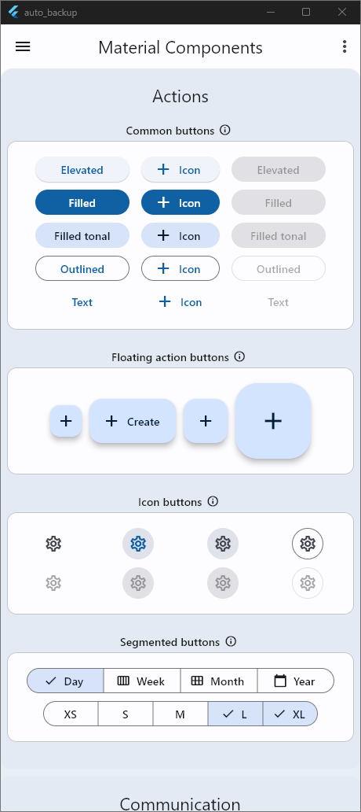
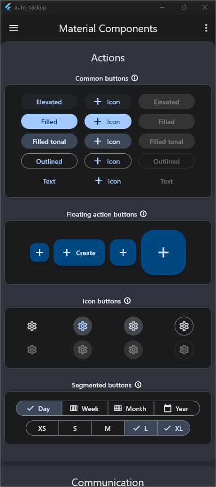
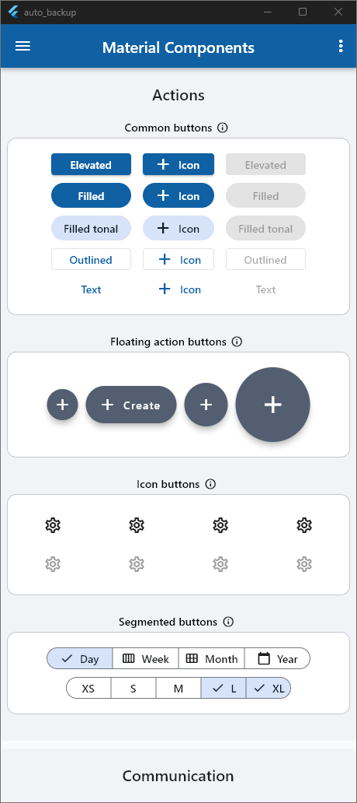
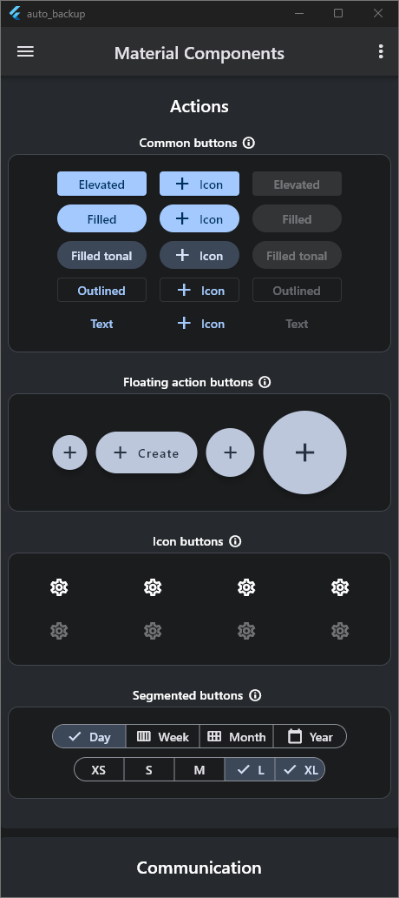

# <div style="text-align: center;">PLEX</div>

<p style="text-align: justify;">
`PLEX` is a UI framework for Flutter designed specifically for building enterprise applications. It provides a robust and customizable foundation for the entire application, including boilerplate code for main.dart file, routes, screens, and other essential components.

In addition to the basic application structure, `PLEX` comes with pre-built components for common UI elements such as tableviews and forms. The tableviews can be easily customized to display data in various formats like lists and grids, while the forms can collect data from users using different
input
types like text fields, dropdowns, and checkboxes.

`PLEX` also offers guidelines and best practices for building enterprise applications, including data management, architecture, testing, and more. These guidelines can help developers to build scalable, maintainable, and high-performance applications.

The `PLEX` framework is an ideal choice for developers who want to build enterprise-level applications quickly and efficiently, without compromising on quality or customization. Its pre-built components and best practices can save developers a significant amount of time and effort, while also
ensuring
the resulting application meets the high standards of enterprise-level software.
</p>

#### Note:

`PLEX` also provide a single click to move from `Material 2` to `Material 3` and `Light Mode` to `Dark Mode`.

## Screenshots

### Material 3

<div style="text-align: center;">


</div>

### Material 2

<div style="text-align: center;">


</div>

## Features

1. Create boilerplate code for an **Application**
2. Built in login screen
3. Built in User session manager
4. Free useful widgets
5. Free useful utilities
6. Built in screens and pages
7. Builtin form builder from model class

## Getting started

Install the `plex` in your application.

## Usage

```dart
void main() {
  WidgetsFlutterBinding.ensureInitialized();
  runApp(PlexApp(
    themeFromColor: const Color(0xFF26A9E1),
    //themeFromImage: const AssetImage('assets/images/logo.png'),
    //You can also use image to load theme by image color pallets but dont use both at the same time
    appLogo: Image.asset(Assets.assetsLogo),
    title: 'Application Name',
    initialRoute: '/dashboard',

    //Optional
    useAuthorization: true,
    //Optional Note: But required when useAuthorization is true
    loginConfig: PlexLoginConfig(
        additionalWidgets: Container(),
        onLogin: (email, password) async {
          //Chek user credentials
          //If anything wrong return null
          //If authentication is successfull return a PlexUser object 
          //or subclass of PlexUser
          return PlexUser({
            "Key": "Value",
          });
        }),
    routes: [
      //Use plex Route to add another screen in the application
      PlexRoute(
        route: '/dashboard',
        category: "Tables",
        title: "Data Table",
        logo: const Icon(Icons.account_balance_outlined),
        //Return a widget that will be displayed when this page or route is called
        screen: (key, context) =>
            Container(
              //This PlexDataTable usage will show how you can show a data table using plex
              child: PlexDataTable(
                headerTextStyle: const TextStyle(fontWeight: FontWeight.bold),
                headerBackground: Colors.red,
                alternateColor: Colors.lightGreen,
                columns: [
                  PlexDataCell.text("Id"),
                  PlexDataCell.text("First Name"),
                  PlexDataCell.text("Last Name"),
                  PlexDataCell.text("Emp Code"),
                  PlexDataCell.text("Designation"),
                  PlexDataCell.text("Grade"),
                  PlexDataCell.text("Company"),
                ],
                rows: [
                  [
                    PlexDataCell.text("1"),
                    PlexDataCell.text("Abdur"),
                    PlexDataCell.text("Rahman"),
                    PlexDataCell.text("EMP953346RT"),
                    PlexDataCell.text("Software Engineer"),
                    PlexDataCell.text("Grade / Scale"),
                    PlexDataCell.custom(
                      "Company Pvt. Ltd",
                      const DataCell(
                        Text("Company Pvt. Ltd", style: TextStyle(color: Colors.lime)),
                      ),
                    ),
                  ],
                  [
                    PlexDataCell.text("1"),
                    PlexDataCell.text("Abdur"),
                    PlexDataCell.text("Rahman"),
                    PlexDataCell.text("EMP953346RT"),
                    PlexDataCell.text("Software Engineer"),
                    PlexDataCell.text("Grade / Scale"),
                    PlexDataCell.custom(
                      "Company Pvt. Ltd",
                      const DataCell(
                        Text("Company Pvt. Ltd", style: TextStyle(color: Colors.lime)),
                      ),
                    )
                  ],
                ],
              ),
            ),
      ),
      //Other Screens
      PlexRoute(
        route: '/settings',
        category: "Settings",
        title: "Settings",
        logo: const Icon(Icons.settings),
        screen: (key, context) => Container(),
      ),
    ],
  ));
}
```
